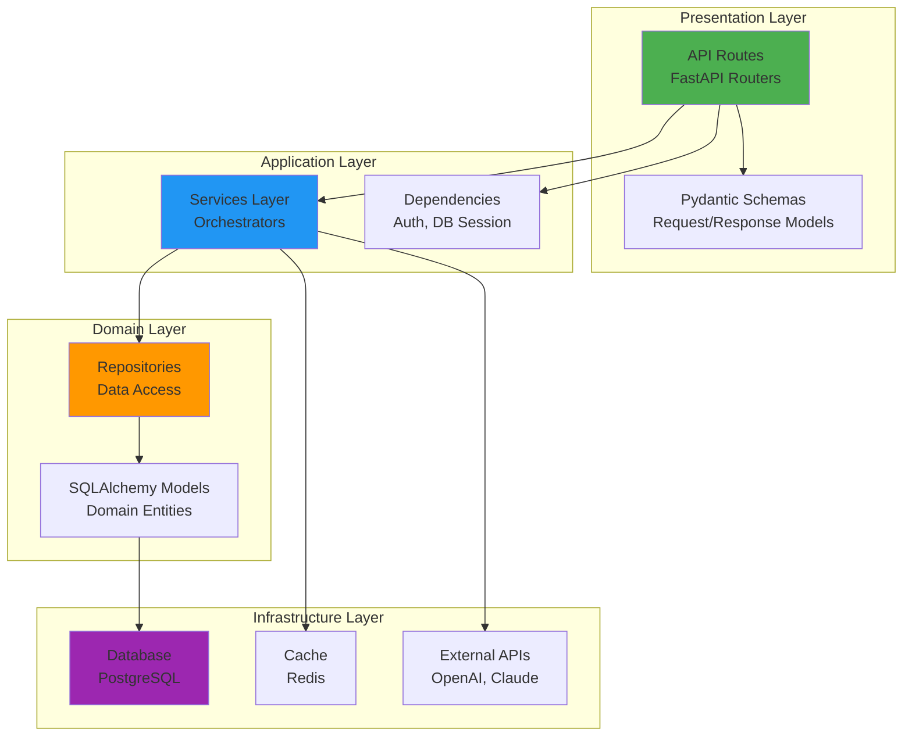
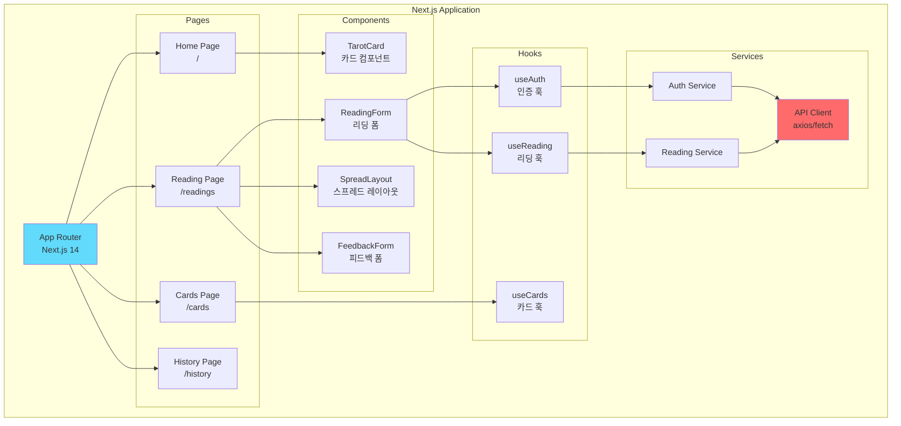
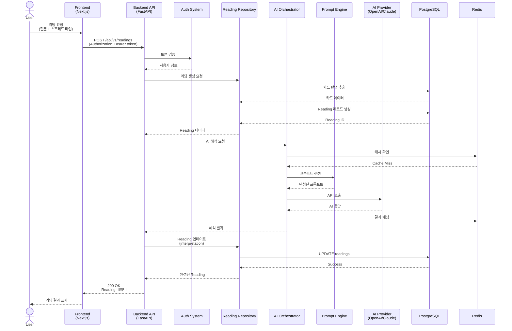
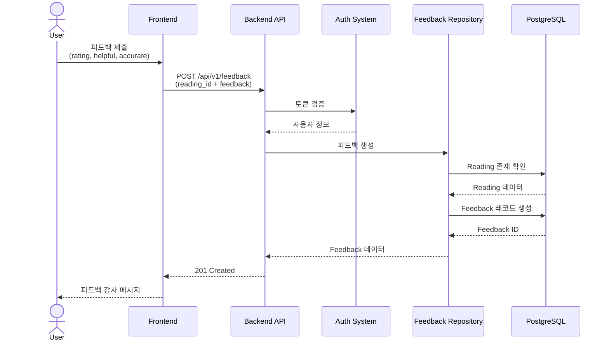
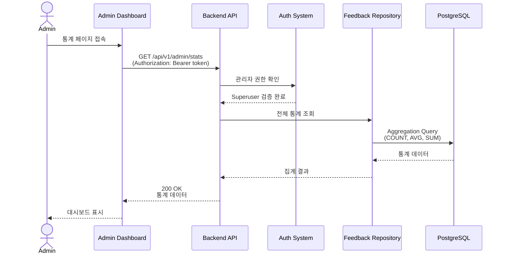
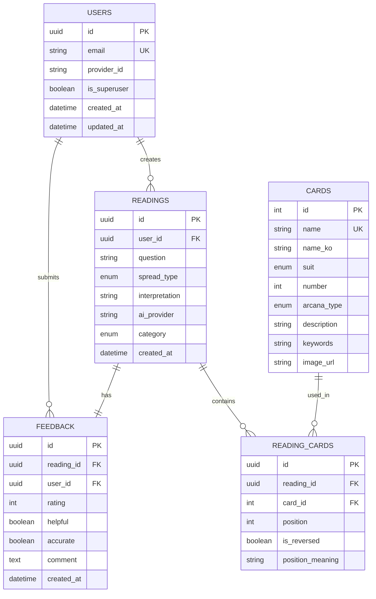
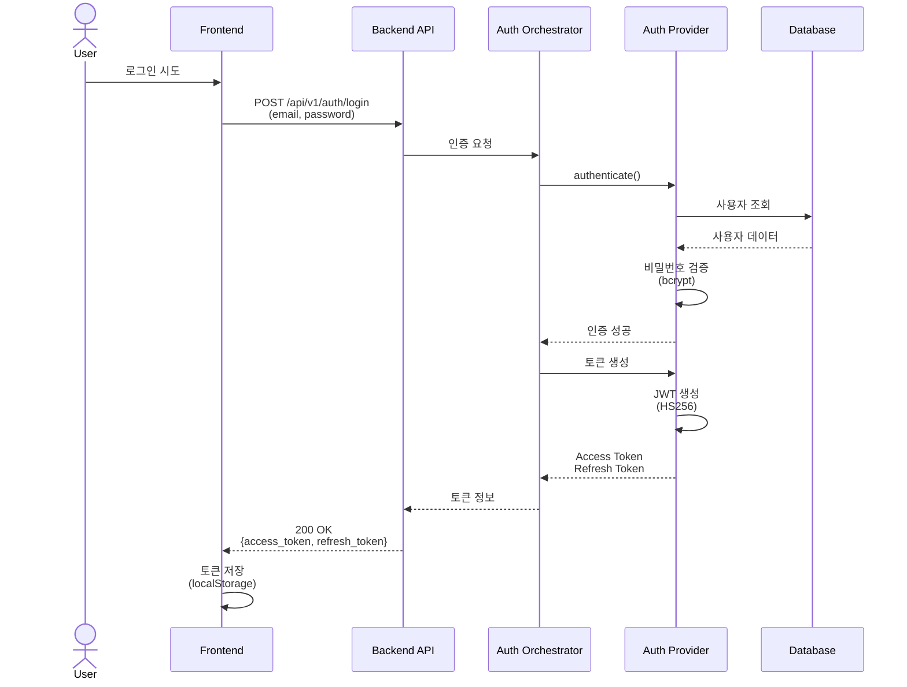
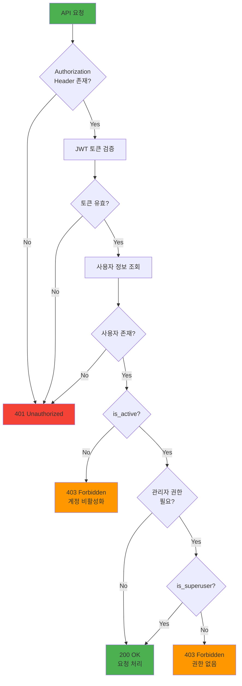
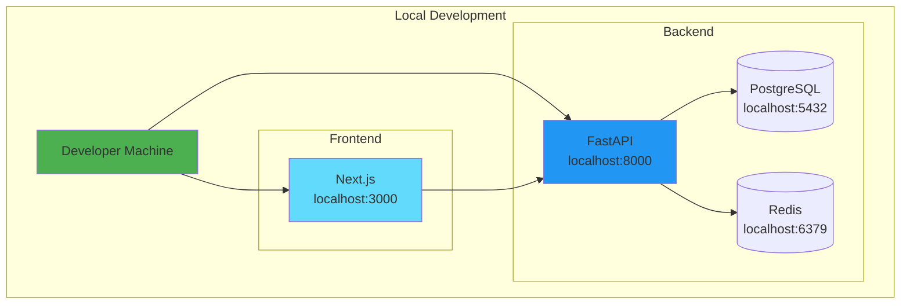
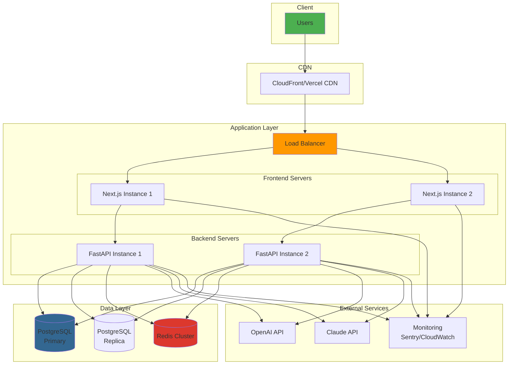

# 타로 AI 리딩 서비스 - 시스템 아키텍처

## 문서 정보
- **버전**: 1.0
- **작성일**: 2025-10-22
- **최종 수정일**: 2025-10-22
- **작성자**: Development Team

---

## 목차
1. [시스템 개요](#시스템-개요)
2. [전체 시스템 구성도](#전체-시스템-구성도)
3. [백엔드 아키텍처](#백엔드-아키텍처)
4. [프론트엔드 아키텍처](#프론트엔드-아키텍처)
5. [데이터 흐름](#데이터-흐름)
6. [데이터베이스 스키마](#데이터베이스-스키마)
7. [보안 아키텍처](#보안-아키텍처)
8. [배포 아키텍처](#배포-아키텍처)

---

## 시스템 개요

타로 AI 리딩 서비스는 사용자에게 AI 기반 타로 카드 리딩을 제공하는 웹 애플리케이션입니다.

### 핵심 기능
- 타로 카드 조회 및 검색
- AI 기반 타로 리딩 (원카드, 쓰리카드, 켈틱크로스 등)
- 다중 AI 프로바이더 지원 (OpenAI GPT-4, Anthropic Claude)
- 사용자 인증 및 회원 관리
- 리딩 이력 관리
- 피드백 및 통계 시스템

### 기술 스택
- **Frontend**: Next.js 14, React 18, TypeScript, Tailwind CSS
- **Backend**: FastAPI, Python 3.11+, SQLAlchemy
- **Database**: PostgreSQL 14
- **Cache**: Redis
- **AI**: OpenAI GPT-4, Anthropic Claude 3.5 Sonnet
- **Auth**: JWT, Firebase Auth, Auth0 (Multi-provider)

---

## 전체 시스템 구성도

```mermaid
graph TB
    subgraph "Client Layer"
        Client[Web Browser<br/>Next.js 14 + React]
    end

    subgraph "Frontend Layer"
        NextJS[Next.js Application<br/>Port 3000]
        UI[UI Components<br/>TarotCard, ReadingForm]
        State[State Management<br/>React Hooks]
    end

    subgraph "Backend Layer - FastAPI"
        API[FastAPI Application<br/>Port 8000]

        subgraph "API Routes"
            CardsRoute[/api/v1/cards]
            ReadingsRoute[/api/v1/readings]
            AuthRoute[/api/v1/auth]
            FeedbackRoute[/api/v1/feedback]
            AdminRoute[/api/v1/admin]
        end

        subgraph "Business Logic"
            CardRepo[Card Repository]
            ReadingRepo[Reading Repository]
            FeedbackRepo[Feedback Repository]
            UserRepo[User Repository]

            AIOrch[AI Orchestrator]
            PromptEngine[Prompt Engine]
            ContextBuilder[Context Builder]
            ResponseParser[Response Parser]

            AuthOrch[Auth Orchestrator]
            AuthFactory[Auth Provider Factory]
        end

        subgraph "AI Providers"
            OpenAI[OpenAI Provider<br/>GPT-4]
            Claude[Claude Provider<br/>Claude 3.5 Sonnet]
        end

        subgraph "Auth Providers"
            JWT[JWT Provider]
            Firebase[Firebase Provider]
            Auth0[Auth0 Provider]
        end
    end

    subgraph "Data Layer"
        PostgreSQL[(PostgreSQL<br/>Database)]
        Redis[(Redis<br/>Cache)]
    end

    subgraph "External Services"
        OpenAIAPI[OpenAI API]
        ClaudeAPI[Anthropic API]
        FirebaseAuth[Firebase Auth]
        Auth0Service[Auth0 Service]
    end

    Client --> NextJS
    NextJS --> UI
    NextJS --> State
    NextJS --> API

    API --> CardsRoute
    API --> ReadingsRoute
    API --> AuthRoute
    API --> FeedbackRoute
    API --> AdminRoute

    CardsRoute --> CardRepo
    ReadingsRoute --> ReadingRepo
    ReadingsRoute --> AIOrch
    FeedbackRoute --> FeedbackRepo
    AdminRoute --> FeedbackRepo
    AuthRoute --> AuthOrch

    AIOrch --> PromptEngine
    AIOrch --> ContextBuilder
    AIOrch --> ResponseParser
    AIOrch --> OpenAI
    AIOrch --> Claude

    OpenAI --> OpenAIAPI
    Claude --> ClaudeAPI

    AuthOrch --> AuthFactory
    AuthFactory --> JWT
    AuthFactory --> Firebase
    AuthFactory --> Auth0

    Firebase --> FirebaseAuth
    Auth0 --> Auth0Service

    CardRepo --> PostgreSQL
    ReadingRepo --> PostgreSQL
    FeedbackRepo --> PostgreSQL
    UserRepo --> PostgreSQL

    CardRepo --> Redis
    AIOrch --> Redis

    style Client fill:#e1f5ff
    style NextJS fill:#61dafb
    style API fill:#009688
    style PostgreSQL fill:#336791
    style Redis fill:#dc382d
    style OpenAIAPI fill:#10a37f
    style ClaudeAPI fill:#191919
```

---

## 백엔드 아키텍처

### 레이어드 아키텍처



### 디렉토리 구조

```
backend/
├── src/
│   ├── api/                    # API Layer
│   │   ├── routes/             # API 엔드포인트
│   │   │   ├── cards.py        # 카드 API
│   │   │   ├── readings.py     # 리딩 API
│   │   │   ├── auth.py         # 인증 API
│   │   │   ├── feedback.py     # 피드백 API
│   │   │   └── admin.py        # 관리자 API
│   │   ├── repositories/       # 데이터 액세스
│   │   │   ├── card_repository.py
│   │   │   ├── reading_repository.py
│   │   │   ├── feedback_repository.py
│   │   │   └── user_repository.py
│   │   └── dependencies/       # FastAPI Dependencies
│   │       └── auth.py         # 인증 의존성
│   ├── auth/                   # 인증 시스템
│   │   ├── orchestrator.py     # Auth Orchestrator
│   │   ├── factory.py          # Provider Factory
│   │   └── providers/          # Auth Providers
│   │       ├── jwt_provider.py
│   │       ├── firebase_provider.py
│   │       └── auth0_provider.py
│   ├── ai/                     # AI 시스템
│   │   ├── orchestrator.py     # AI Orchestrator
│   │   ├── providers/          # AI Providers
│   │   │   ├── openai_provider.py
│   │   │   └── claude_provider.py
│   │   └── prompt_engine/      # 프롬프트 엔진
│   │       ├── template_engine.py
│   │       ├── context_builder.py
│   │       └── response_parser.py
│   ├── models/                 # SQLAlchemy Models
│   │   ├── card.py
│   │   ├── reading.py
│   │   ├── feedback.py
│   │   └── user.py
│   ├── schemas/                # Pydantic Schemas
│   │   ├── card_schema.py
│   │   ├── reading_schema.py
│   │   ├── feedback_schema.py
│   │   └── auth_schema.py
│   ├── core/                   # Core Infrastructure
│   │   ├── config.py           # Configuration
│   │   ├── database.py         # Database Connection
│   │   ├── cache.py            # Redis Cache
│   │   └── logging.py          # Logging Setup
│   └── tarot/                  # 타로 비즈니스 로직
│       ├── cards/              # 카드 데이터
│       └── spreads/            # 스프레드 정의
├── alembic/                    # Database Migrations
├── tests/                      # Unit & Integration Tests
├── scripts/                    # Utility Scripts
├── prompts/                    # AI 프롬프트 템플릿
└── main.py                     # Application Entry Point
```

### 주요 컴포넌트 설명

#### 1. API Routes (프레젠테이션 계층)
- FastAPI 라우터를 통한 RESTful API 제공
- Pydantic을 이용한 요청/응답 검증
- OpenAPI (Swagger) 자동 문서화

#### 2. Repositories (데이터 접근 계층)
- 데이터베이스 CRUD 작업 추상화
- SQLAlchemy ORM을 통한 타입 안전한 쿼리
- 통계 및 집계 쿼리 메서드

#### 3. AI Orchestrator (비즈니스 로직 계층)
- 다중 AI 프로바이더 통합
- 프롬프트 생성 및 컨텍스트 빌딩
- AI 응답 파싱 및 검증
- 캐싱을 통한 성능 최적화

#### 4. Auth Orchestrator (인증 계층)
- 다중 인증 프로바이더 지원
- JWT 토큰 생성 및 검증
- Firebase/Auth0 연동

---

## 프론트엔드 아키텍처

### 컴포넌트 구조



### 디렉토리 구조

```
frontend/
├── app/                        # Next.js App Router
│   ├── page.tsx               # 홈페이지
│   ├── cards/                 # 카드 페이지
│   ├── readings/              # 리딩 페이지
│   └── history/               # 이력 페이지
├── components/                 # React 컴포넌트
│   ├── tarot/                 # 타로 관련 컴포넌트
│   │   ├── TarotCard.tsx
│   │   ├── SpreadLayout.tsx
│   │   └── ReadingResult.tsx
│   ├── forms/                 # 폼 컴포넌트
│   │   ├── ReadingForm.tsx
│   │   └── FeedbackForm.tsx
│   └── common/                # 공통 컴포넌트
│       ├── Button.tsx
│       └── Modal.tsx
├── hooks/                      # Custom React Hooks
│   ├── useAuth.ts
│   ├── useReading.ts
│   └── useCards.ts
├── services/                   # API 서비스
│   ├── api.ts                 # API Client
│   ├── auth.service.ts
│   └── reading.service.ts
├── types/                      # TypeScript 타입 정의
│   ├── card.types.ts
│   └── reading.types.ts
└── public/                     # 정적 파일
    └── cards/                 # 카드 이미지
```

---

## 데이터 흐름

### 타로 리딩 요청 플로우



### 피드백 제출 플로우



### 관리자 통계 조회 플로우



---

## 데이터베이스 스키마

### ERD (Entity Relationship Diagram)



### 주요 테이블 설명

#### 1. users (사용자)
- 인증된 사용자 정보 저장
- 다중 인증 프로바이더 지원 (provider_id)
- 관리자 플래그 (is_superuser)

#### 2. cards (타로 카드)
- 78장의 타로 카드 마스터 데이터
- 메이저/마이너 아르카나 분류
- 한글/영문 이름, 키워드, 설명

#### 3. readings (리딩 기록)
- 사용자의 타로 리딩 이력
- AI 해석 결과 저장
- 스프레드 타입별 분류

#### 4. reading_cards (리딩 카드 매핑)
- Reading과 Card의 다대다 관계
- 카드 위치(position), 정/역방향 정보
- 위치별 의미

#### 5. feedback (피드백)
- 리딩에 대한 사용자 평가
- 만족도 점수 (1-5)
- 도움됨/정확함 Boolean 플래그

---

## 보안 아키텍처

### 인증 플로우



### 권한 검증 플로우



### 보안 기능

1. **비밀번호 보안**
   - bcrypt 해싱 (cost factor: 12)
   - Salt 자동 생성

2. **JWT 토큰**
   - HS256 알고리즘
   - Access Token: 60분 유효
   - Refresh Token: 7일 유효

3. **API 보안**
   - CORS 설정 (허용 도메인 제한)
   - Rate Limiting (추후 구현 예정)
   - Input Validation (Pydantic)

4. **데이터베이스 보안**
   - SQL Injection 방지 (SQLAlchemy ORM)
   - 환경 변수로 인증 정보 관리
   - 연결 풀링

---

## 배포 아키텍처

### 개발 환경



### 프로덕션 환경 (계획)



---

## 기술 스택 상세

### Backend
```yaml
Runtime:
  - Python 3.11+

Framework:
  - FastAPI 0.104+
  - Uvicorn (ASGI Server)

ORM & Database:
  - SQLAlchemy 2.0+
  - Alembic (Migration)
  - asyncpg (PostgreSQL Driver)

Validation:
  - Pydantic 2.0+

Authentication:
  - PyJWT
  - python-jose
  - passlib (bcrypt)
  - firebase-admin
  - authlib (Auth0)

AI Integration:
  - openai
  - anthropic
  - tiktoken

Cache:
  - redis-py

Testing:
  - pytest
  - pytest-asyncio
  - httpx (async client)

Code Quality:
  - black (formatter)
  - flake8 (linter)
  - mypy (type checker)
```

### Frontend
```yaml
Framework:
  - Next.js 14+
  - React 18+

Language:
  - TypeScript 5+

Styling:
  - Tailwind CSS 3+
  - Framer Motion (animations)

HTTP Client:
  - axios / fetch

State Management:
  - React Hooks
  - Context API

Testing:
  - Jest
  - React Testing Library

Code Quality:
  - ESLint
  - Prettier
```

### Infrastructure
```yaml
Database:
  - PostgreSQL 14+

Cache:
  - Redis 7+

Deployment (Planned):
  - Docker
  - Docker Compose
  - AWS / Vercel
  - GitHub Actions (CI/CD)

Monitoring (Planned):
  - Sentry (Error Tracking)
  - CloudWatch (Logging)
  - Prometheus + Grafana (Metrics)
```

---

## 성능 최적화

### 1. 캐싱 전략
- **카드 데이터**: Redis에 전체 카드 목록 캐싱 (TTL: 24시간)
- **AI 응답**: 동일한 카드 조합 + 질문 유사도 기반 캐싱 (TTL: 1시간)
- **사용자 세션**: Redis에 JWT 토큰 정보 캐싱

### 2. 데이터베이스 최적화
- **인덱싱**: user_id, reading_id, created_at 등 자주 조회되는 컬럼
- **Pagination**: 대량 데이터 조회 시 페이지네이션 적용
- **연결 풀**: SQLAlchemy connection pooling (pool_size: 10)

### 3. API 최적화
- **비동기 처리**: FastAPI의 async/await 활용
- **응답 압축**: gzip 압축
- **Lazy Loading**: 필요한 데이터만 조회

---

## 확장성 고려사항

### 수평 확장 (Horizontal Scaling)
- Stateless API 설계 (세션 정보는 Redis에 저장)
- Load Balancer를 통한 다중 인스턴스 운영
- Database Read Replica를 통한 읽기 성능 향상

### 수직 확장 (Vertical Scaling)
- Database 인스턴스 사양 업그레이드
- Redis 메모리 증설
- AI API Rate Limit 증가

### 마이크로서비스 전환 (향후 계획)
- Auth Service 분리
- AI Service 분리
- Reading Service 분리

---

## 버전 히스토리

| 버전 | 날짜 | 변경 사항 |
|------|------|-----------|
| 1.0 | 2025-10-22 | 초기 아키텍처 문서 작성 |

---

## 참고 문서
- [PROJECT_PLAN.md](./PROJECT_PLAN.md) - 프로젝트 계획
- [INTEND.md](./INTEND.md) - 요구사항 명세
- [TASK.md](./TASK.md) - 작업 목록
- [FastAPI Documentation](https://fastapi.tiangolo.com/)
- [Next.js Documentation](https://nextjs.org/docs)
